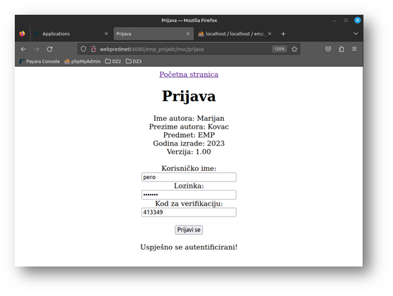

<a name="readme-top"></a>

<div align="right">
<a href="./README.en.md"></a>
</div>

<!-- INTRO --> 
<br />
<div align="center">
  
  

  <h3 align="center">Dvostruka prijava</h3>

  <p align="center">
    Jednostavna Java web aplikacija koja implementira sustav dvostruke prijave upotrebom Google Authenticatora
    <br /> 
    <a href="https://nastava.foi.hr/course/93120"><strong>Saznajte više »</strong></a>
    <br />

  </p>

  <br>
  
  <!-- TABLE OF CONTENTS -->

  <a href="#-uvod">Uvod</a> • 
  <a href="#-opis-projekta">Opis projekta</a> • 
  <a href="#-konfiguracija">Konfiguracija</a> • 
  <a href="#-upotreba">Upotreba</a> • 
  <a href="#-korišteni-alati">Korišteni alati</a>
</div>

<br>

<!-- ABOUT THE PROJECT -->
## 📖 Uvod

### Općenito

<table>
  <tbody>
    <tr>
      <td>👦🏽 Autor</td>
      <td>Marijan Kovač</td>
    </tr>
    <tr>
      <td>🧑🏽‍🏫 Nastavnik</td>
      <td>Dr. sc. Sandro Gerić</td>
    </tr>
    <tr>
      <td>📚 Kolegij</td>
      <td>Elektroničko i mobilno poslovanje</td>
    </tr>
    <tr>
      <td>🏛️ Ustanova</td>
      <td>Sveučilište u Zagrebu <br> Fakultet organizacije i informatike <br> Varaždin</td>
    </tr>
    <tr>
      <td>📆 Godina <br>polaganja</td>
      <td>2023</td>
    </tr>
  </tbody>
</table>

<p align="right">(<a href="#readme-top">povratak na vrh</a>)</p>

## 📝 Opis projekta

Sustav funkcionira na vrlo jednostavan način. Web aplikacija za svoj rad koristi dva
temeljna resursa – bazu podataka za pohranjivanje informacija o korisničkom računu i Google
Authenticator API za kreiranje tajnog ključa te provjeru ispravnosti jednokratne lozinke.

Korisnik web aplikacije za registraciju i prijavu u sustav, osim korisničkog imena i lozinke
treba i mobilni uređaj koji će imati instaliran Google Authenticator i koji će predstavljati token,
odnosno drugi korak u postupku njegove prijave.

Na slici je moguće vidjeti dizajn sustava ove aplikacije. <br><br>

<div align="center">
  <a href="./emp_projekt/images/dizajn_sustava.png"></a>
</div>

<br>

Što se tiče baze podataka, ona će sadržavati samo jednu tablicu u koju će se
pohranjivati korisničko ime, lozinka te tajni ključ za Google Authenticator aplikaciju – jedinstven
za korisnika, koji služi kao sjeme (eng. seed) za generiranje jednokratnih lozinki.

Izgled tablice:

<div align="center">
  <a href="./emp_projekt/images/Picture6.png"></a>
</div>

<br>

Za detalje kliknite <a href="./emp_projekt/Dvostruka prijava.pdf"><strong>ovdje</strong></a>.

<p align="right">(<a href="#readme-top">povratak na vrh</a>)</p>

## ⚙️ Konfiguracija

### Preduvjeti

Za pokretanje rješenja bit će vam potrebno sljedeće:

* Operativni sustav Linux (preporuka)
  
  Za izradu rješenja korišten je <a href="https://linuxmint.com/">Linux Mint</a> na <a href="https://www.virtualbox.org/">Oracle VirtualBox VM</a>. 

* Java 17 ili veća:
  * smjestite se u željeni direktorij za preuzimanja, npr:
  ```bash
  cd /opt/alati/
  ```

  * preuzmite Java OpenJDK 17.0.2:
  ```bash
  curl https://download.java.net/java/GA/jdk17.0.2/dfd4a8d0985749f896bed50d7138ee7f/8/GPL/openjdk-17.0.2_linux-x64_bin.tar.gz -O
  ```

  * smjestite se u slijedeći direktorij (preporuka):
  ```bash
  cd /usr/lib/jvm
  ```

  * izdvojite arhivu:
  ```bash
  sudo tar -xvf /opt/alati/openjdk-17.0.2_linux-x64_bin.tar.gz -C .
  ```

  * podesite varijablu okruženja:

  Otvorite datoteku `/etc/profile.d/jdk.sh`

  i promijenite/dodajte slijedeću liniju:

  ```bash
  export JAVA_HOME=/usr/lib/jvm/jdk-17.0.2
  ```

  * restartirajte sustav (preporuka)

  * provjerite ispravnost instalacije:

  ```bash
  java -version
  ```

  Ako je sve bilo u redu, trebali biste dobiti rezultat sličan ovome:

  ```bash
  openjdk version "17.0.2" 2022-01-18
  OpenJDK Runtime Environment (build 17.0.2+8-86)
  OpenJDK 64-Bit Server VM (build 17.0.2+8-86, mixed mode, sharing)
  ```

* Maven (opcionalno):
  * ažurirajte repozitorij:
  ```bash
  sudo apt update
  ```
  * instalirajte Maven:
  ```bash
  sudo apt install maven
  ```
  * provjerite ispravnost instalacije:
  ```bash
  mvn -version
  ```
  Ako je sve bilo u redu, trebali biste dobiti rezultat sličan ovome:
  ```bash
  Apache Maven 3.6.3
  Maven home: /usr/share/maven
  Java version: 17.0.2, vendor: Oracle Corporation, runtime: /usr/lib/jvm/jdk-17.0.2
  Default locale: en_US, platform encoding: UTF-8
  OS name: "linux", version: "5.15.0-69-generic", arch: "amd64", family: "unix"
  ```

* Eclipse IDE

  Preuzmite i instalirajte <a href="https://www.eclipse.org/ide/">Eclipse IDE</a>. Konfigurirajte Eclipse IDE za Java 17 prema potrebi.

* Payara

  * Preuzmite Payara Server 6.2023.4 (Web) na sljedećoj <a href="https://www.payara.fish/downloads/payara-platform-community-edition/"><strong>poveznici</strong></a>.

    ⚠️ Za projekt je korištena verzija 6.2023.4, međutim ista možda više nije dostupna, pa je potrebno preuzeti najnoviju verziju. To znači da naredbe u nastavku treba prilagoditi kako bi iste funkcionirale.

  * Kopirati datoteku s `Downloads` na `/opt/alati`

  * Smjestiti se u direktorij `/opt`
    
    ```bash
    cd /opt
    ```

  * Izvršiti naredbu

    ```bash
    sudo unzip alati/payara-6.2023.4.zip
    mv payara6/ payara-web-6.2023.4
    ```

  * Podesiti prava pristupa ⚠️

    ```bash
    sudo chown -R {admin} payara-web-6.2023.4
    sudo chgrp -R users payara-web-6.2023.4
    sudo chmod -R g+w payara-web-6.2023.4
    ```

* Baza podataka (phpmyadmin + mysql):

  * Instalirajte LAMP (preporuka):

    ```bash
    sudo apt-get update
    sudo apt-get install -y tasksel
    sudo tasksel install lamp-server
    ```

  Time će se instalirati svi potrebni alati za rad sa phpmyadmin-om. Za više informacija kliknite <a href="https://ubuntu.com/server/docs/get-started-with-lamp-applications"><strong>ovdje</strong></a>.

  * Moguće je i pojedinačno instalirati potrebne alate:

    ⚠️ Preskočiti ovaj korak ako je instaliran LAMP

    * Instalirajte apache2 server:

      ```bash
      sudo apt-get install apache2
      ```

    * Instalirajte mysql:

      ```bash
      sudo apt-get install mysql-server
      ```

    * Instalirajte php:

      ```bash
      sudo apt-get install php
      ```

  * Sada se može instalirati phpmyadmin:

      ```bash
      sudo apt install phpmyadmin
      ```

    * Nakon instalacije posjetite

      ```bash
      localhost/phpmyadmin
      ```

    * Zadani podaci za prijavu su:

      ```bash
      username: root
      password: root
      ```

* MySql Connector/J

  * Preuzmite <a href="https://downloads.mysql.com/archives/c-j/"><strong>MySql Connector/J </strong></a>

    * Product Version: 8.0.32
    * Operating System: Platform Independent

  * Dodajte preuzeti driver Payara serveru:

    * Izvršite naredbu:

    Smjestite se u direktorij Payara Web servera, npr:

    ```bash
    /opt/payara-web-6.2023.4/bin
    ```
  
    Potom izvršite naredbu:

    ```bash
    asadmin add-library /path/to/mysql-connector-j-8.0.32.jar
    ```

    ⚠️ Potrebno je prilagoditi putanju onoj gdje se nalazi preuzeta datoteka. <strong>Prije toga je potrebno izvršiti raspakiravanje (extract)</strong>.

    * Alternativno se može ručno dodati datoteka na sljedeću destinaciju:

    ```bash
    /opt/payara-web-6.2023.4/glassfish/lib
    ```

    ⚠️ Možda će biti potrebno promijeniti prava pristupa

<br>

### Priprema

  * Klonirajte ovaj repozitorij:

    ```bash
    https://github.com/mkovac700/emp.git
    ```

  * Otvorite projekt u Eclipse IDE:

    * `File > Open Projects from File System... > Directory...` 

    * Odaberite korijenski direktorij projekta
  
  * Uvezite postavke konfiguracija za buildanje aplikacija u Eclipse IDE (preporuka):

    * `File > Import... > Run/Debug > Launch Configurations > Browse...`

    * Konfiguracije se nalaze u direktoriju:

      ```bash
      emp/emp_projekt/config
      ```

  * Podesite bazu podataka:

    * Pokrenite Apache2 server i MySQL bazu podataka koristeći naredbe:

      ```bash
      sudo service apache2 start
      sudo service mysql start
      ```

    * Posjetite stranicu `localhost/phpmyadmin`

      Za prijavu koristite

      ```bash
      username: root
      password: root
      ```

    * Kreirajte novu bazu
    
      * Naziv: `emp_db`

        ⚠️ Bitno je da naziv bude isti kako bi sve bilo kompatibilno s konfiguracijama projekta

      * Collation: `utf8mb4_croatian_ci`

        ⚠️ Važno je odabrati navedeni Collation kako ne bi došlo do grešaka kod kreiranja

    * Dodajte tablicu `korisnik`

      Uvezite ili kopirajte skriptu 

      ```bash
      emp/emp_projekt/scripts/emp_db.sql
      ```

  * Podesite JDBC Resource i Connection Pool

    👉🏽 Za rad aplikacije baza se koristi kao DataSource, pa je potrebno kreirati JDBC Resource i Connection Pool unutar Payara servera

    * JDBC Connection Pools:

      * Unutar Payara Console (`localhost:4848`) odaberite `Resources > JDBC > JDBC Connection Pools`

      * Kliknite na `New` te unesite kako slijedi:

      <div align="center">
        <a href="./emp_projekt/images/Screenshot_4.png"></a>
      </div>

      <br>

      <div align="center">
        <a href="./emp_projekt/images/Screenshot_5.png"></a>
      </div>

      <br>

      👉🏽 Na kartici `General` sada možete koristiti opciju `Ping` kako biste testirali vezu s bazom

      <br>

    * JDBC Resource:

      * Unutar Payara Console (`localhost:4848`) odaberite `Resources > JDBC > JDBC Connection Pools`

      * Kliknite na `New` te unesite kako slijedi:

      <div align="center">
        <a href="./emp_projekt/images/Screenshot_6.png"></a>
      </div>

    <br>

    👉🏽 Za više detalja kliknite <a href="https://blog.payara.fish/using-mysql-with-payara"><strong>ovdje</strong></a>.

<p align="right">(<a href="#readme-top">povratak na vrh</a>)</p>

## 🚀 Upotreba

* Pokretanje Payara Web servera (ako nije pokrenut):

  * U direktoriju `emp/emp_projekt` otvorite terminal (`Desni klik > Open in Terminal`) i izvršite naredbu:

    ```bash
    ./scripts/pokreniServer.sh
    ```

  * Payara Console dostupna je na `localhost:4848`

    * Klikom na `Applications` moguće je vidjeti popis isporučenih (deployanih) aplikacija

    * Klikom na `server (Admin Server) > View Raw Log` moguće je uživo pratiti logove servera (kontrola rada aplikacija, iznimke i sl.)

* Sada se može obaviti isporuka aplikacije:

  * Unutar Eclipse IDE izvršite konfiguraciju `emp_projekt - redeploy`

    ⚠️ U slučaju greške kod deploya, provjeriti jesu li ispravno napravljeni svi prethodni koraci 

  * Provjeriti je li aplikacija isporučena na Payara server (`Payara Console > Applications`)

    <div align="center">
      <a href="./emp_projekt/images/Screenshot_7.png"></a>
    </div>
    <br>

  * Aplikacija je dostupna na adresi `http://localhost:8080/emp_projekt/`

    👉🏽 Unutar `Payara Console > Applications` kliknite na `Launch` te na poveznicu aplikacije.

* Početna stranica:

  <div align="center">
    <a href="./emp_projekt/images/Picture7.png"></a>
  </div>

* Registracija korisnika s uputama za postavljanje Google Authenticatora:

  <div align="center">
    <a href="./emp_projekt/images/Picture2.png"></a>
  </div>

  👉🏽 Sigurnosni ključ se nasumično generira svakim ponovnim učitavanjem stranice

  <br>

* Google Authenticator i TOTP:

  <div align="center">
    <a href="./emp_projekt/images/20230525_203104.jpg"></a>
  </div>

* Prijava korisnika s trenutnim TOTP:

  <div align="center">
    <a href="./emp_projekt/images/Picture3.png"></a>
  </div>

* Pokušaj prijave s pogrešnim TOTP:

  <div align="center">
    <a href="./emp_projekt/images/Picture4.png"></a>
  </div>

<p align="right">(<a href="#readme-top">povratak na vrh</a>)</p>

## ⛏️ Korišteni alati

<div align="center">
  
  <a href="https://www.java.com/en/"></a>
  <a href="https://www.eclipse.org/"></a>
  <a href="https://maven.apache.org/"></a>
  
          
</div>

<p align="right">(<a href="#readme-top">povratak na vrh</a>)</p>


